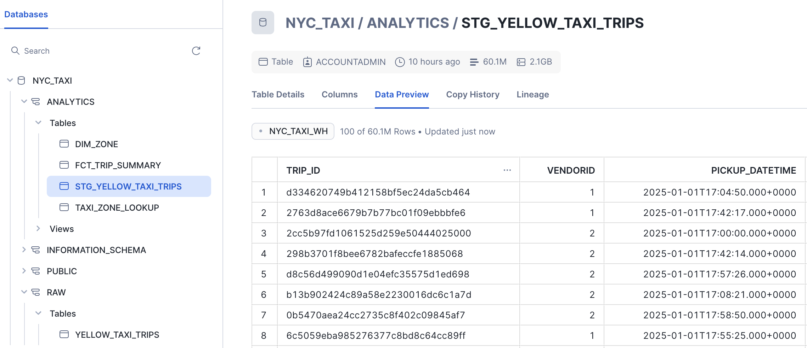
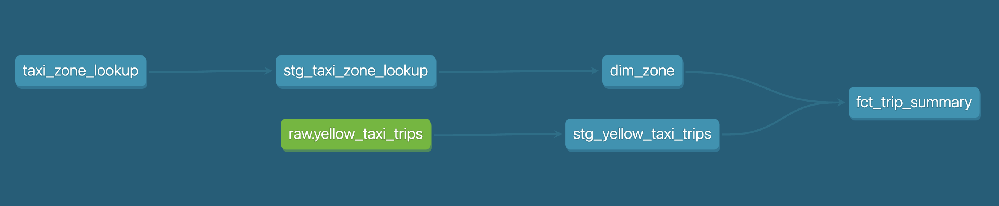

# NYC Taxi Data Pipeline with dbt + Snowflake

This project demonstrates a modern data pipeline using [NYC Yellow Taxi trip data](https://www.nyc.gov/site/tlc/about/tlc-trip-record-data.page). It loads, models, and aggregates data in **Snowflake**, orchestrated with **dbt Core** and integrated with **Docker**.

---

## Tech Stack

- **dbt Core** for transformations and modeling
- **Snowflake** for data warehousing
- **Python** for ingestion of raw parquet files
- **Docker / Docker Compose** for reproducible environments
- **NYC Taxi Dataset (2024–2025)** as the source

---

## How It Works

1. **Ingestion**  
   Python script downloads and uploads parquet files into Snowflake’s `raw` schema.

2. **Staging (dbt)**  
   Converts raw fields into typed and usable formats (e.g., timestamps), adding unique `trip_id`.

3. **Transformation (dbt)**  
   Aggregates hourly trips by pickup/dropoff borough, distance, fare, and revenue.

4. **Seeding (dbt)**  
   Loads `taxi_zone_lookup.csv` into a dimension table for joins.

### Snowflake Schemas and Tables


### dbt DAG

---

## Commands

### Build the Docker image
```
docker-compose build
```

### Load environment variables
Create a `.env` file (based on `.env.example`) and populate with your Snowflake credentials:

```
cp .env.example .env
```

---

### Ingest raw Parquet data into Snowflake
This uses a Python script to bulk upload 2024–2025 NYC Yellow Taxi data:

```
docker-compose run --rm dbt python scripts/load_yellow_taxi.py
```

---

### Seed static lookup tables (e.g. taxi zones)

```
docker-compose run --rm dbt dbt seed
```

---

### Run all dbt models (staging → marts)

```
docker-compose run --rm dbt dbt run
```

To run a specific model (e.g. just the fact table):

```
docker-compose run --rm dbt dbt run --select fct_trip_summary
```

---

### Run dbt tests

```
docker-compose run --rm dbt dbt test
```

---

## Testing
- Python unit tests for ingestion script
- dbt model-level tests (e.g., `not_null`, `unique`)

---

## Next Steps
- Further cleansing of the data
     - handling duplicates, missing data, negative values
- Visualizations
    - Hourly trip volume by borough
    - Fare in tip metrics
    - Heatmaps of pickup vs dropoff zones

---

## References

- [NYC Taxi Trip Data](https://www.nyc.gov/site/tlc/about/tlc-trip-record-data.page)  
  Official data source for NYC yellow, green, and for-hire vehicle trip records.

- [dbt Documentation](https://docs.getdbt.com)  
  dbt Core and dbt Cloud documentation, including guides on incremental models, testing, and deployment.

- [Snowflake Documentation](https://docs.snowflake.com)  
  Snowflake SQL reference, copy commands, file formats, and performance tuning tips.

- [Docker Compose Docs](https://docs.docker.com/compose/)  
  Useful for understanding service definitions, volume mounts, and multi-container development.

---

## Author

Jordan Jenkins

[GitHub](https://github.com/jordanjenkins) • [LinkedIn](https://www.linkedin.com/in/jordan-jenkins587/)
